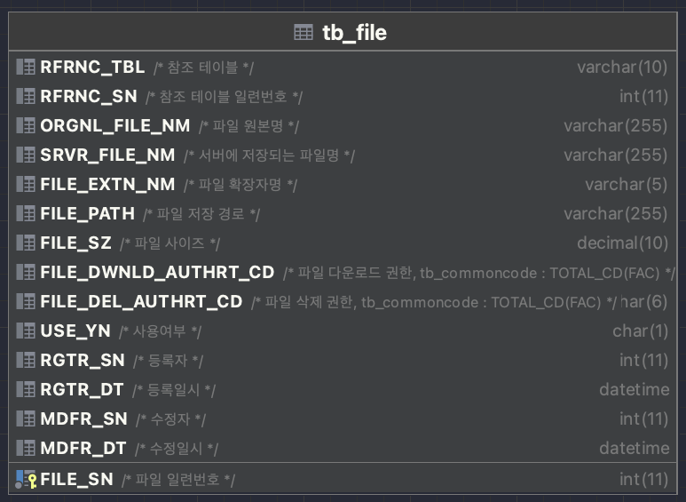

# 파일 업로드 / 다운로드

### 1. 파일 테이블 구조


---
### 2. 예제 코드

```java
public class NoticeController {
  @PostMapping("/notice/new")
  @ResponseBody
  public Response create(@ModelAttribute @Validated NoticeForm noticeForm, HttpSession session) throws Exception {
    // 1. 로그인 사용자 정보 조회
    Member loginMember = memberService.getLoginMember(session);

    // 2. entity 생성
    Notice notice = noticeForm.toEntity();

    // 3. 공지사항 등록
    noticeService.saveNotice(notice);

    // 4. 파일 업로드
    if(!FileUtils.isEmpty(noticeForm.getFiles())) {
      UploadInfo info = new UploadInfo();
      info.setFiles(FileUtils.getFiles(noticeForm.getFiles()));
      info.setRfrncTbl(ReferenceTable.NOTICE);
      info.setRfrncSn(notice.getNtcSn());

      fileService.uploadFiles(info);
    }

    return ResponseHandler.success();
  }
}
```

`List<MultipartFile>` 형태로 파일 객체를 들고온 뒤 `fileService` 의 `uploadFiles` 메소드를 호출한다.

```java
public class UploadInfo {
  private List<MultipartFile> files;

  private ReferenceTable rfrncTbl;

  private Long rfrncSn;

  //    @Value("${spring.servlet.multipart.location}")
  private String rootPath = PropertiesLoader.getProperties("spring.servlet.multipart.location").toString();

  /**
   * 기본 파일 경로
   */
  //String rootPath = EgovProperties.getProperty("Globals.file.path");
  private FileAuth fileDwnldAuthrtCd = FileAuth.ALL;
  private FileAuth fileDelAuthrtCd = FileAuth.OWNER;

  private AllowFileExt allowFileExt = AllowFileExt.ALL;

  private Long rgtrSn;

  public boolean isValid() {
    return files.size() != 0 && rfrncTbl != null && rfrncSn != null && rootPath != null && fileDwnldAuthrtCd != null && fileDelAuthrtCd != null;
  }

  public String getAbsoluteFilePath() {
    if (!rootPath.endsWith(File.separator)) {
      rootPath += File.separator;
    }
    return rootPath + rfrncTbl.name() + File.separator + rfrncSn + File.separator;
  }
}

```
파일 업로드를 위한 설정 정보를 관리하는 클래스이다

---

### 3. 특징
<b> ** UploadInfo.java </b>

- RfrncTbl & RfrncSn

    - 이 파일이 어떤 테이블과 매칭되는지 결정하기 위해 참조값인 `RfrncTbl` 과 `RfrncSn` 를 반드시 지정해야 한다.
    - `RfrncTbl` 은 `enum` 으로 정의되어 있으며 파일 업로드가 필요한 테이블의 `key`(구분자) 값을 등록하여 사용한다.

- rootPath

    - `rootPath` 는 파일이 저장되는 서버 경로이다. `application.yml` 에 기본 경로가 지정되어 있으며 상황에 맞게 바꿔서 사용할 수 있다.

- FileAuth

    - `fileDwnldAuthrtCd`와 `fileDelAuthrtCd` 는 각각 다운로드 권한, 삭제 권한을 뜻하며 디폴트로 다운로드는 '모두', 삭제는 파일 업로드의 '소유자'만 가능하도록 설정되어 있다.

    - 실수를 줄이기 위해 `enum` 클래스인 `FileAuth` 에 권한이 설정되어 있으며 `FileUtils` 에서 각 프로젝트에 맞게 권한을 설정한다.  
- AllowFileExt
    - 파일 업로드 시 확장자를 제한하기 위해 설정한다. `enum` 으로 정의된 `FileExt` 와 `AllowFileExt` 를 통해 확장자를 확인한다. 디폴트로 'ALL(제한없음)' 이 설정되어 있으며 `AllowFileType.isValid(String ext)` 메소드로 타입을 확인하여 사용한다.

<b> ** 파일 업로드 경로 및 이름 </b>

- 파일 업로드 경로 규칙은 `'rootPath / RfrncTbl / RfrncSn'` 이다. (ex : /srv/base-proj-boot/upload/NOTICE/41)
- 파일명은 UUID 를 통해 임의의 문자열로 대체된다.


<br/>


# 클라이언트 사용 예제
- HTML
```html
<label for="files">
    <button type="button" class="btn08 btn_grey" onclick="document.frm.files.click()">파일선택</button>
</label>
<input type="file" name="files" id="files" multiple style="display: none" onchange="handleFiles(this.files)"/>
```

- javascript
```javascript
function handleFiles(files) {
    let fileNames = getFileNames(files);

    let temp = '';
    for (let i = 0; i < fileNames.length; i++) {
        temp += `<p>${fileNames[i]}</p>`;
    }
    $('#file_contents').html(temp);

    // 이미지 파일 미리보기
    let img = previewImage(files[0]);
    $('#preViewArea').append(img);
}
```

- js/common/utils/file.js
```javascript
// 파일 명 조회
function getFileNames(files) {
    let names = [];
    for(let i=0; i<files.length; i++) {
        names.push(files[i].name)
    }
    return names;
}

// 이미지 파일 미리보기
function previewImage(file) {
    if (!file.type.startsWith('image/')) {
        return false;
    }

    const img = document.createElement("img");
    img.classList.add("obj");
    img.file = file;
    const reader = new FileReader();

    reader.onload = (function (aImg) {
        return function (e) {
            aImg.src = e.target.result;
        };
    })(img);

    reader.readAsDataURL(file);

    return img;
}
```